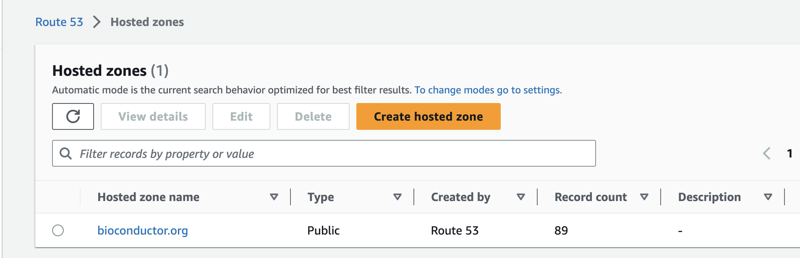
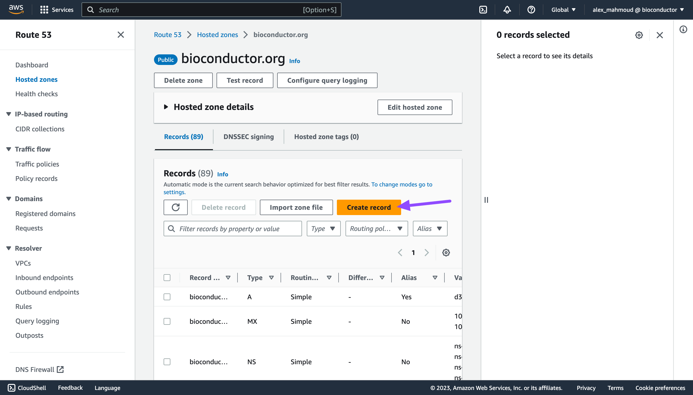
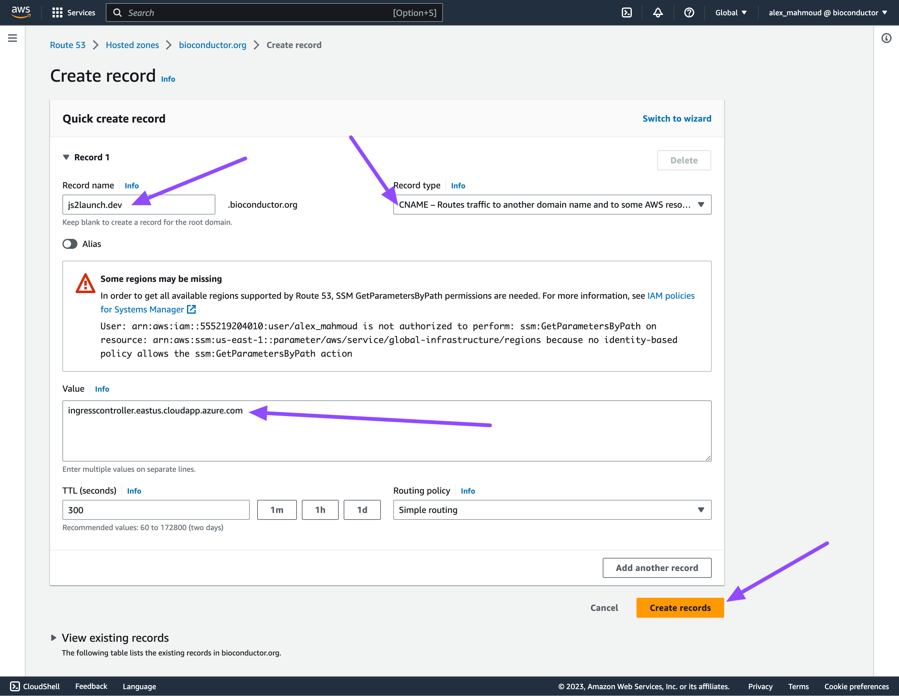

{}
This document provides a practical step-by-step guide for getting started with the Azure Kubernetes Service.
{}


## General Context

This document was created while moving the CloudLaunch instance ([js2launch.bioconductor.org](https://js2launch.bioconductor.org)) to the Microsoft allocation on AKS, in hopes of having more long-term stability, and not having the tool to create new Jetstream clusters rely itself on a Jetstream cluster. That situation was particularly bad in the context of running clusters going down due to a Jetstream error, and losing the ability to launch a new cluster and redeploy the resources.

[CloudLaunch](https://github.com/galaxyproject/cloudlaunch/) is a Django-based API written in python, allowing deployment of a few applications, notably VMs, Docker images, and Ansible playbooks. CloudLaunch depends on the [CloudBridge](https://github.com/cloudve/cloudbridge) library, allowing a single code to communicate with various clouds via configuration changes.

## Prerequisites

This document assumes you have a running Kubernetes cluster, notably an Azure Kubernetes Service cluster, with some notes on running in other environments. You may follow one of the related documents for getting started with Kubernetes:
- [Getting started with the Azure Kubernetes Service](k8s-aks.md)

This document also assumes you have access to the Route 53 service in Bioconductor's Amazon Web Services, where routing subdomains will take place.

This document assumes that you have the Azure CLI installed, that you are logged in (`az login`), and that you have access to the `bioconductor` resource group. See [Microsoft's documentation on installing the Azure CLI for your operating system](https://learn.microsoft.com/en-us/cli/azure/install-azure-cli).

You must also have `kubectl` installed, which might have already been installed by another software (eg: Azure, AWS, Docker). You may check with `kubectl --version`, and follow the [Kubernetes documentation](https://kubernetes.io/docs/tasks/tools/) to install `kubectl` on your Operating System (or re-install, which is recommended if your Client version is under 1.24).

Additionally, `helm` is required for installing groups of Kubernetes reources bundled as applications. You may follow the [Helm documentation](https://helm.sh/docs/intro/install/) to install, and use `helm version` to check.

## Route 53 Subdomain Route
When using an ingress and subdomain, CloudLaunch health checks expect the endpoint to properly route before marking the pods healthy, it is thus recommended to create the Route 53 record before starting the deployment.

First, head to the [AWS Console at console.aws.amazon.com](https://console.aws.amazon.com/) and login into the `bioconductor` account with your identity.

You can then head to the [Route 53 Hosted Zones](https://console.aws.amazon.com/route53/v2/hostedzones) where you should see the `bioconductor.org` domain like the screenshot below.



After clicking on the domain, you should see a list of subdomains and have the ability to create a record. For an AKS cluster, the subdomain must use a CNAME type record, pointing to the `cloudapp.azure.com` domain of the ingress controller. For an RKE Jetstream cluster, the subdomain must use an A record type, pointing to the IP address of the cluster head node. The below screenshots show an example of a record for a dev cloudlaunch instance on the existing AKS cluster.






## Connecting to an AKS cluster
The below command assumes proper permissions to the Azure namespace. You may follow the rest of the tutorial with another context (eg: Jetstream RKE) with slight modifications notably to the `storageClass`, and using the cluster head node's IP for the subdomain routing.

```
RESOURCE_GROUP=bioconductor
CLUSTER_NAME=bioc-aug2023-aks
az aks get-credentials -g $RESOURCE_GROUP -n $CLUSTER_NAME
kubectl config use-context bioc-aug2023-aks
```

## Deploying CloudLaunch
<strong>THE CODE BELOW REQUIRES PASTING CONTENT FROM BITWARDEN.</strong>
CloudLaunch values include sensitive information, including database secrets. The [CloudLaunch Helm Chart](https://github.com/CloudVE/cloudlaunch-helm) is used, with `--version 0.6.0` as of Aug 2023.
You may note the values include a mention of js2launch.bioconductor.org at various points. You may `sed` them all for a new ingress to deploy a side server at a subdomain.

```
cat << "EOF" > js2launch.vals
[REPLACE WITH PASTED CONTENT]
EOF

helm repo add gxy https://github.com/cloudve/helm-charts/raw/devel
helm repo update

# sed 's/js2launch.bioconductor.org/js2launch.dev.bioconductor.org/g' js2launch.vals

helm upgrade --install --create-namespace -n cloudlaunch js2cloudlaunch gxy/cloudlaunch -f js2launch.vals

rm js2launch.vals
```

Deployment will take a few minutes, as a postgres database needs to first be deployed and created before the API and UI pods get started. After a few minutes, the CloudLaunch app should be available at the chosen subdomain.


