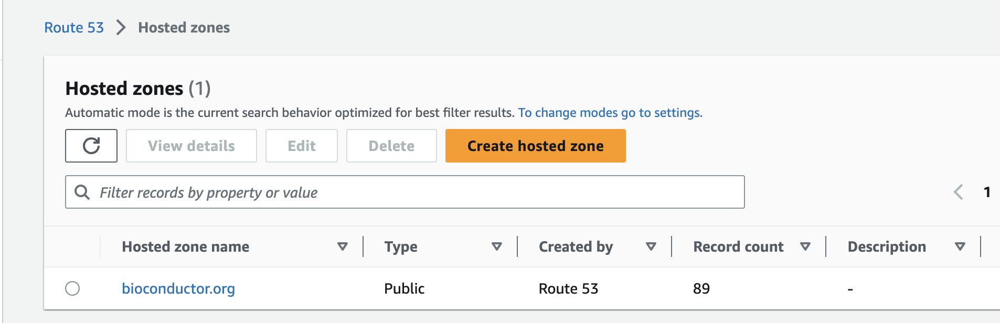

{}
This document provides a practical step-by-step guide for getting started with the Azure Kubernetes Service.
{}


## General Context

This document was created while launching a "warm backup" of the Workshop Galaxy instance in the Microsoft allocation on AKS in Aug 2023.

Our workshop instance is a fork of [Galaxy](https://github.com/galaxyproject/galaxy), comprising some UI and some backend changes not yet pushed upstream to Galaxy as configuration options. As of Aug 2023, the bulk of changes are:
- [Bioc-specific UI changes](https://github.com/almahmoud/galaxy/commits/bioc_smorgasbord_2023)
- [Backend changes pulled from gist at startup (still have hardcoded URL, so pull different gists for [yescure](https://gist.github.com/almahmoud/5f41d327931e23c6dc2fddb9e550efd7) vs [workshop](https://gist.github.com/almahmoud/01218819154ce392f23da3844844d653), so not hardcoded in the image to avoid having to rebuild the image for each deployment)

## Prerequisites

This document assumes you have a running Kubernetes cluster, notably an Azure Kubernetes Service cluster, with some notes on running in other environments. You may follow one of the related documents for getting started with Kubernetes:
- [Getting started with the Azure Kubernetes Service](k8s-aks.md)

This document also assumes you have access to the Route 53 service in Bioconductor's Amazon Web Services, where routing subdomains will take place.

This document assumes that you have the Azure CLI installed, that you are logged in (`az login`), and that you have access to the `bioconductor` resource group. See [Microsoft's documentation on installing the Azure CLI for your operating system](https://learn.microsoft.com/en-us/cli/azure/install-azure-cli).

You must also have `kubectl` installed, which might have already been installed by another software (eg: Azure, AWS, Docker). You may check with `kubectl --version`, and follow the [Kubernetes documentation](https://kubernetes.io/docs/tasks/tools/) to install `kubectl` on your Operating System (or re-install, which is recommended if your Client version is under 1.24).

Additionally, `helm` is required for installing groups of Kubernetes reources bundled as applications. You may follow the [Helm documentation](https://helm.sh/docs/intro/install/) to install, and use `helm version` to check.

## Route 53 Subdomain Route

First, head to the [AWS Console at console.aws.amazon.com](https://console.aws.amazon.com/) and login into the `bioconductor` account with your identity.

You can then head to the [Route 53 Hosted Zones](https://console.aws.amazon.com/route53/v2/hostedzones) where you should see the `bioconductor.org` domain like the screenshot below.



After clicking on the domain, you should see a list of subdomains and have the ability to create a record. For an AKS cluster, the subdomain must use a CNAME type record, pointing to the `cloudapp.azure.com` domain of the ingress controller. For an RKE Jetstream cluster, the subdomain must use an A record type, pointing to the IP address of the cluster head node. The below screenshots show an example of a record for a Jetstream RKE cluster.


Galaxy needs two routes, one for the main Galaxy web handler, i.e. the Galaxy UI at workshop.bioconductor.org, and a wildcard subdomain for the interactive environments. You may just use the wildcard *.workshop.bioconductor.org more generally or include the prefix for deployed interactive tools `its` in the subdomain.
 Both the main UI and the wildcard subdomain should be routed to the same destination, namely a CNAME route to the ingress controller's `cloudapp.azure.com` subdomain for AKS, or an A record to the IP address of the head node for a Jetstream RKE cluster.


## Connecting to an AKS cluster
The below command assumes proper permissions to the Azure namespace. You may follow the rest of the tutorial with another context (eg: Jetstream RKE) with slight modifications notably to the `storageClass`, and using the cluster head node's IP for the subdomain routing.

```
RESOURCE_GROUP=bioconductor
CLUSTER_NAME=bioc-aug2023-aks
az aks get-credentials -g $RESOURCE_GROUP -n $CLUSTER_NAME
kubectl config use-context bioc-aug2023-aks
```


## Deploying wildcard certificate
In order to speed up the deployment of the containers for users, and avoid the generation limit imposed by letsencrypt, we use a wildcard certificate for all subdomains rather than generating a certificate for each launch.
If you followed the previous cluster creation instructions, `cert-manager` should be installed with an authenticated ClusterIssuer deployed. You may use this issuer to get a certificate for your subdomain.

```
cat << "EOF" > cert-its-wildcard.yaml
apiVersion: cert-manager.io/v1
kind: Certificate
metadata:
  name: its-wildcard
  namespace: gxy-bioc
spec:
  commonName: '*.its.workshop.bioconductor.org'
  dnsNames:
  - '*.its.workshop.bioconductor.org'
  issuerRef:
    kind: ClusterIssuer
    name: ssl-wildcard
  secretName: its-wildcard
EOF

kubectl create ns gxy-bioc

kubectl apply -f cert-its-wildcard.yaml
```


## Deploying Galaxy
<strong>THE CODE BELOW REQUIRES PASTING CONTENT FROM BITWARDEN.</strong>
Galaxy values include sensitive information, including database secrets. The [Galaxy Helm Chart](https://github.com/galaxyproject/galaxy-helm) is used, but as a Bioconductor fork distributed via the [Bioconductor Helm Charts repository](https://github.com/Bioconductor/helm-charts).

```
cat << "EOF" > workshop-gxy.vals
[REPLACE WITH PASTED CONTENT]
EOF

NAMESPACE="gxy-bioc"
GXYRELEASE="gxy"
CHARTVER="4.10.4"

helm repo add bioc https://github.com/Bioconductor/helm-charts/raw/devel
helm repo update

helm upgrade --timeout 600s --install --create-namespace -n $NAMESPACE $GXYRELEASE bioc/galaxy --version $CHARTVER --reuse-values -f workshop-gxy.vals

rm workshop-gxy.vals
```

Deployment will take a few minutes, as a postgres database needs to first be deployed and created before the Galaxy job and web handlers start coming up.

